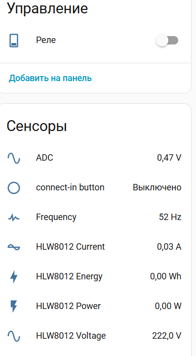
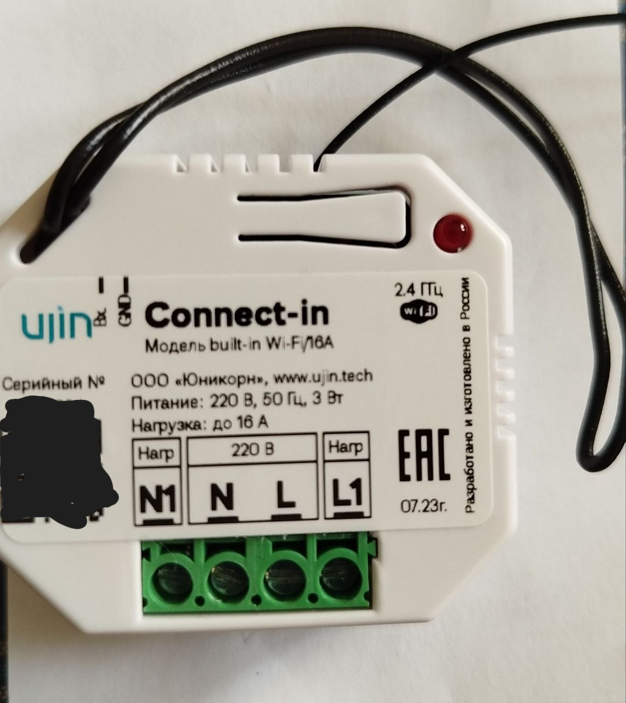
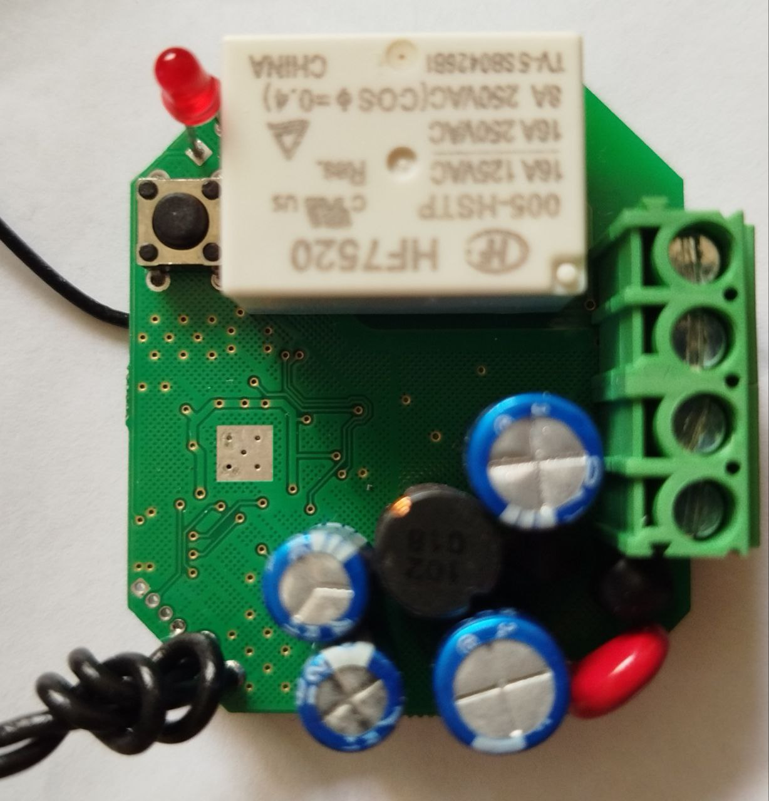

[![License][license-shield]][license]
[![ESPHome release][esphome-release-shield]][esphome-release]

[license-shield]: https://img.shields.io/static/v1?label=License&message=MIT&color=orange&logo=license
[license]: https://opensource.org/licenses/MIT
[esphome-release-shield]: https://img.shields.io/static/v1?label=ESPHome&message=2026.4&color=green&logo=esphome
[esphome-release]: https://GitHub.com/esphome/esphome/releases/

  <h1>🔌 Connect‑in</h1>
  
<strong>Встраиваемое реле в подрозетник с энергомониторингом</strong>

   

> ⚠️ **Важно**: Перед прошивкой на ESPHome обязательно посмотрите LOG устройства и сделайте **резервную копию (backup)**.

---

## 📌 Характеристики

| Параметр | Значение |
|----------|----------|
| **Тип** | Встраиваемое реле в подрозетник |
| **Макс. нагрузка** | **16А** |
| **Энергомониторинг** | ✅ (ток, напряжение, мощность, энергия) |
| **Управление** | Wi-Fi + внешний выключатель |

---

## ✨ Особенности

| № | Особенность |
|:--:|-------------|
| 1 | Встраивается в **стандартный подрозетник** (за выключателем/розеткой) |
| 2 | Управление через **Wi-Fi** (ESPHome) |
| 3 | Подключение **внешнего выключателя** (физическая кнопка) |
| 4 | Измерение энергопотребления подключённой нагрузки |

---

## 🖼️ Внешний вид

| Плата ESP | Общий вид | Монтаж |
|:---:|:---:|:---:|
|  |  |  |

---

## 🔧 Управление

| Способ | Описание |
|--------|----------|
| 📱 **Wi-Fi** | Через ESPHome / Home Assistant / MQTT |
| 🔘 **Внешний выключатель** | Физическая кнопка (обычная или сенсорная) |

> 💡 Управление с выключателя работает даже при отсутствии Wi-Fi!

---

## 📊 Функции энергомониторинга

| Измеряемый параметр | Доступность |
|---------------------|:-----------:|
| ⚡ Ток | ✅ |
| 🔌 Напряжение | ✅ |
| 💪 Мощность | ✅ |
| ⏱️ Потреблённая энергия | ✅ |

---

  
    💡 Разработано для ESPHome | 
    📦 Требуется ESPHome 2026.4+
  

