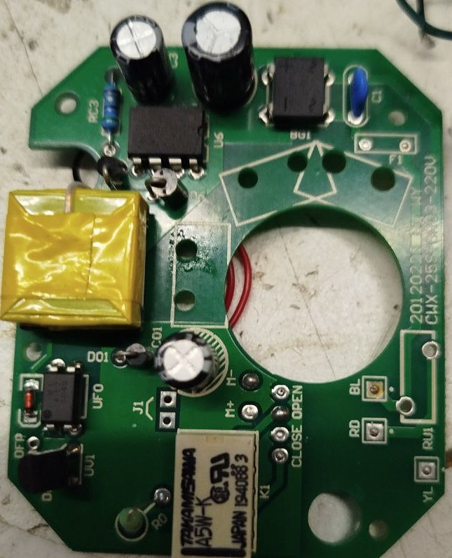
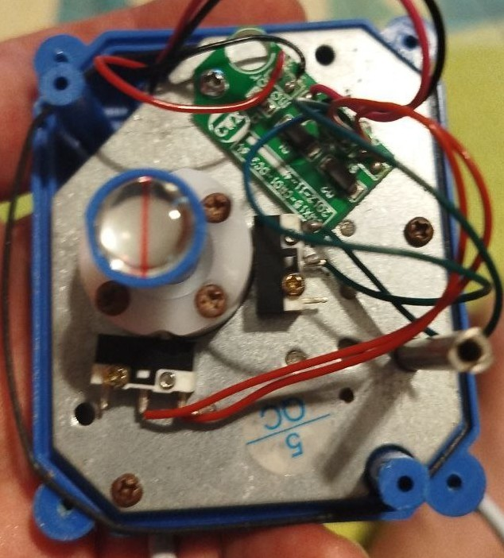
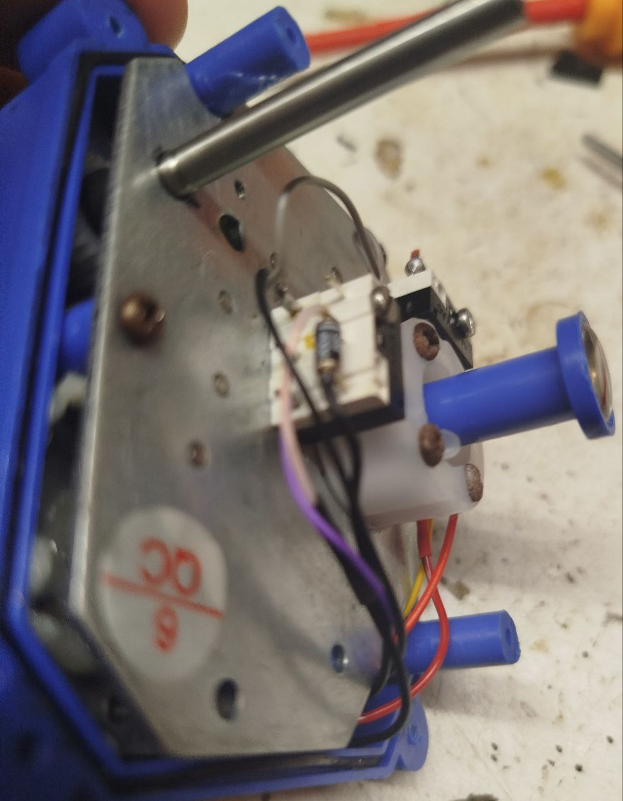
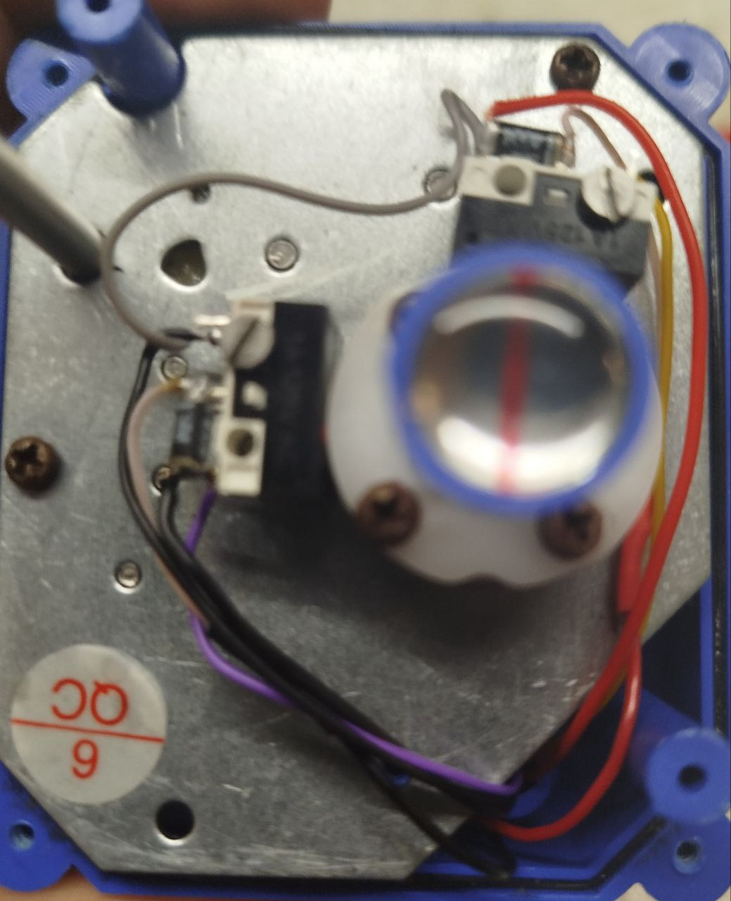

[![License][license-shield]][license]
[![ESPHome release][esphome-release-shield]][esphome-release]

[license-shield]: https://img.shields.io/static/v1?label=License&message=MIT&color=orange&logo=license
[license]: https://opensource.org/licenses/MIT
[esphome-release-shield]: https://img.shields.io/static/v1?label=ESPHome&message=2026.4&color=green&logo=esphome
[esphome-release]: https://GitHub.com/esphome/esphome/releases/

  <h1>🔧 Приводы UJIN</h1>
  
<strong>Шаровые краны с электроприводом для систем водоснабжения</strong>

   

---

## 📌 Модификации приводов

Приводы UJIN выпускаются в **двух вариантах исполнения**:

| Модификация | Напряжение | Особенности |
|-------------|------------|-------------|
| **220V** | 220В переменного тока | ⚠️ Имеет встроенный блок питания (мотор на **5В**) |
| **12V** | 12В постоянного тока | Прямое питание |

  <table>
    <tr>
      <td align="center"> Плата 220V</td>
      <td align="center"> Привод 12V</td>
    </tr>
  </table>

> 🫣 **Комментарий к модификации 220В**  
> Внутри установлен блок питания, а мотор рассчитан на **5В** ([посмотреть фото](./images/board-220_0.jpg))

---

## 🔧 Доработка: контроль состояния

Вы можете добавить **микропереключатель (end-stop)** для контроля положения привода (открыт/закрыт).

| Фото |
|------|
|  |
|  |

---

## 📷 Внешний вид

  
   
  Привод UJIN в сборе

---

## 🌊 Проект «Зимняя вода для улицы с автосливом»

Готовое решение для защиты системы водоснабжения от замерзания в зимний период.

| Проект | Описание |
|--------|----------|
| [❄️ Winter water](/drive/winter_water) | Автоматический слив воды + управление приводом |

---

## 📊 Спецификация

| Параметр | 220V | 12V |
|----------|:----:|:---:|
| Питание мотора | 5В (через БП) | 12В |
| Тип тока | Переменный | Постоянный |
| Встроенный БП | ✅ | ❌ |
| Управление | ESPHome / реле | ESPHome / реле |
| Контроль положения | опционально (микропереключатель) | опционально |

---

## ⚠️ Важные замечания

| № | Примечание |
|:--:|------------|
| 1 | Версия **220V** имеет мотор на **5В** — учитывайте при замене драйвера |
| 2 | Для контроля состояния привода рекомендуется добавить **микропереключатель** |
| 3 | Проект «Зимняя вода» включает готовую автоматику для улицы |

---

  
    💡 Разработано для ESPHome | 
    📦 Требуется ESPHome 2026.4+
  

